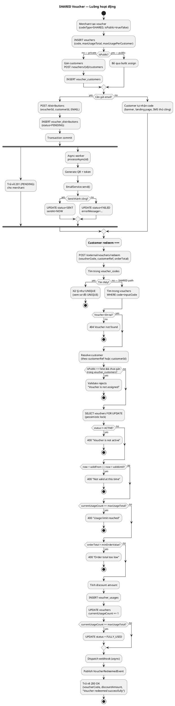

# Activity Diagrams — SHARED vs UNIQUE Voucher

## 1. SHARED Voucher — Activity Diagram

---

## 2. UNIQUE Voucher — Activity Diagram

```plantuml
@startuml activity_unique_voucher
title UNIQUE Voucher — Luồng hoạt động

start

:Merchant tạo voucher\n(codeType=UNIQUE, isPublic=false);
:INSERT vouchers (parent);

:=== Sinh pool unique codes ===;
:POST /vouchers/{id}/codes/generate\n?quantity=N;

repeat
    :Random Base62 8 ký tự;
    :Check collision với code đã có;
    :INSERT voucher_codes\n(voucher_id, code,\ncustomer_id=NULL, used=false);
repeat while (đủ N code?) is (chưa) not (đủ)

:=== Gán quyền cho customer ===;
:POST /vouchers/{id}/customers\n{customerIds};
:INSERT voucher_customers;

:=== Phân phối (gửi email) ===;
:POST /distributions\n(voucherId, customerId, EMAIL);
:INSERT voucher_distributions\n(status=PENDING);
:Transaction commit;

fork
    :Trả về 201 (PENDING)\ncho merchant;
fork again
    :Async worker processAsync(id);

    :SELECT voucher_codes\nWHERE voucher_id=X\nAND customer_id IS NULL\nLIMIT 1;

    if (Còn code chưa gán?) then (no)
        :status=FAILED\n"No unassigned codes";
        stop
    else (yes)
    endif

    :UPDATE voucher_codes\nSET customer_id=request.customerId\n(gán mã riêng cho khách);

    :Generate QR token từ unique code;
    :EmailService.send\n(customer.email, unique_code, QR);

    if (Email OK?) then (yes)
        :UPDATE distribution\nstatus=SENT;
    else (no)
        :UPDATE distribution\nstatus=FAILED;
    endif
end fork

:=== Customer redeem unique code ===;
:POST /external/vouchers/redeem\n(voucherCode=unique_code,\ncustomerRef, orderTotal);

:Tìm trong voucher_codes\nWHERE code=inputCode;

if (Tìm thấy?) then (no)
    :Fallback tìm vouchers\n(path SHARED);
    stop
else (yes — UNIQUE path)
endif

if (voucher_codes.used == true?) then (yes)
    :409 "Voucher đã được sử dụng";
    stop
else (no)
endif

:Resolve customer;

if (voucher_codes.customer_id != null\n&& != request.customer.id?) then (yes)
    :403 "Voucher không thuộc\nvề khách hàng";
    stop
else (no)
endif

:Lấy parent voucher từ voucher_codes.voucher;
:SELECT vouchers FOR UPDATE;

if (status != ACTIVE?) then (yes)
    :400 "Not active";
    stop
else (no)
endif

if (out of validity period?) then (yes)
    :400 "Not valid at this time";
    stop
else (no)
endif

if (orderTotal < minOrderValue?) then (yes)
    :400 "Order total too low";
    stop
else (no)
endif

:Tính discount amount;
:INSERT voucher_usages;
:UPDATE vouchers\ncurrentUsageCount += 1;

:UPDATE voucher_codes\nSET used=true\nusedAt=NOW();

if (customer_id chưa gán?) then (yes)
    :UPDATE voucher_codes\nSET customer_id=customer.id;
else (no)
endif

:Dispatch webhook;
:Publish event;

:Trả về 200 OK\n{voucherCode=unique_code,\ndiscountAmount,\n"Voucher redeemed successfully"};

stop
@enduml
```

---

## 3. So sánh nhánh quyết định chính

| Bước | SHARED | UNIQUE |
|------|--------|--------|
| Sinh code | ❌ Dùng code cha | ✅ `POST /codes/generate?quantity=N` |
| Gán quyền | ⚠️ Chỉ khi `isPublic=false` | ✅ Bắt buộc (`voucher_customers`) |
| Distribution | Tuỳ chọn | Thường cần để gán unique code |
| Redeem lookup | `vouchers` | `voucher_codes` trước, lấy parent |
| Ownership check | Qua `voucher_customers` | Qua `voucher_codes.customer_id` |
| Đếm lượt dùng | `currentUsageCount++` | `currentUsageCount++` + `used=true` |
| Dùng lại code? | Có (đến `maxUsageTotal`) | ❌ Không (`used=true`) |
