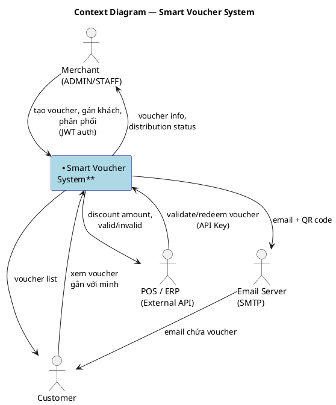
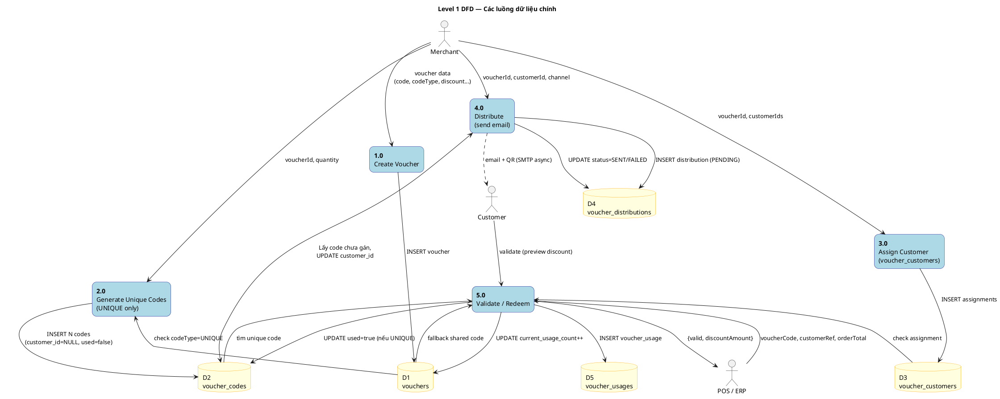
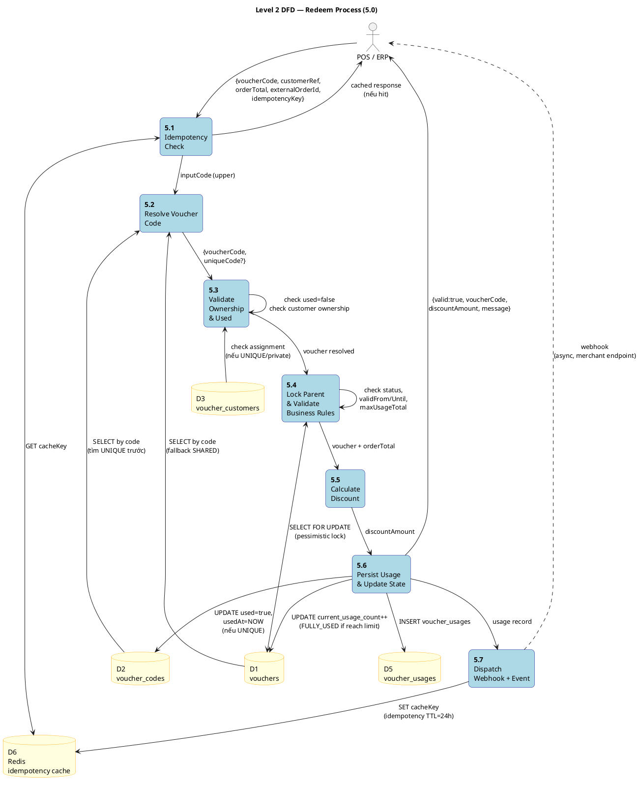
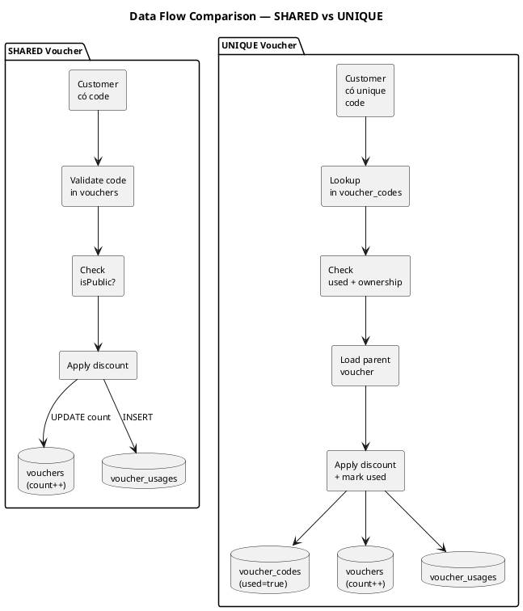

# DFD — Luồng Voucher (SHARED & UNIQUE)

## 1. Context Diagram (Level 0)

Hệ thống nhìn như một hộp đen — ai tương tác, truyền/nhận gì.

---

## 2. Level 1 DFD — Các process chính

---

## 3. Level 2 DFD — Process 5.0 "Validate / Redeem" (chi tiết)

Process phức tạp nhất — resolve code, validate, apply discount.

---

## 4. Data Flow — SHARED vs UNIQUE (so sánh)

---

## 5. Chú giải ký hiệu DFD

| Ký hiệu | Ý nghĩa |
|---------|---------|
| `actor` | **External Entity** — thực thể ngoài hệ thống (người, hệ thống khác) |
| `rectangle` tròn góc | **Process** — xử lý dữ liệu, đánh số 1.0, 2.0, 5.1... |
| `database` | **Data Store** — bảng/cache lưu trữ dữ liệu (D1, D2...) |
| `-->` | **Data Flow** — hướng dữ liệu di chuyển |
| `..>` | **Async Flow** — dữ liệu truyền bất đồng bộ (email, webhook) |

## 6. Mapping Process ↔ Code

| Process | Service class | Endpoint |
|---------|--------------|----------|
| 1.0 Create Voucher | `VoucherService.create()` | `POST /api/v1/vouchers` |
| 2.0 Generate Codes | `VoucherCodeService.generateCodes()` | `POST /vouchers/{id}/codes/generate` |
| 3.0 Assign Customer | `VoucherService.assignCustomers()` | `POST /vouchers/{id}/customers` |
| 4.0 Distribute | `DistributionService` + `DistributionProcessor` | `POST /api/v1/distributions` |
| 5.0 Redeem | `VoucherRedemptionService.redeem()` | `POST /external/vouchers/redeem` |
| 5.1–5.7 | Các bước bên trong `redeem()` | (cùng endpoint) |
