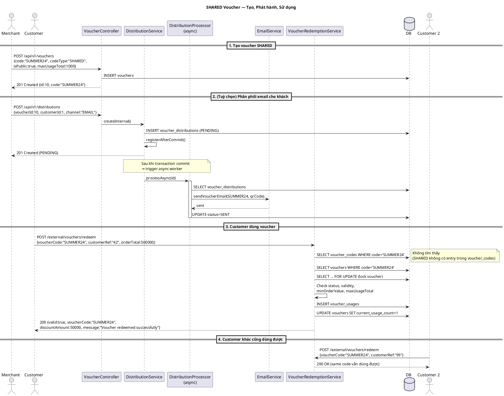
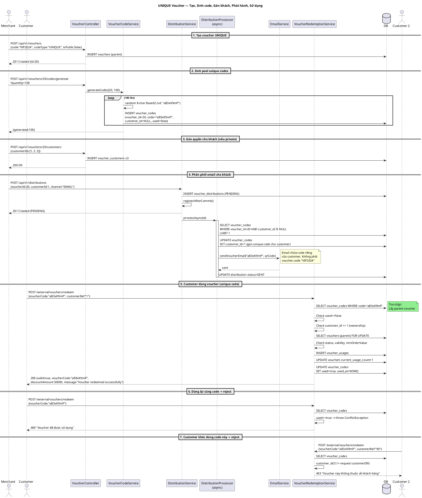

# Sequence Diagrams — SHARED vs UNIQUE Voucher

## 1. SHARED Voucher (Public, dùng chung)

Một mã code duy nhất, ai biết code đều có thể dùng. Giới hạn bởi `maxUsageTotal` và `maxUsagePerCustomer`.

---

## 2. UNIQUE Voucher (Private, mỗi customer một mã riêng)

Một voucher "cha" có N mã con sinh sẵn. Mỗi mã dùng được **1 lần**, gán cho **1 customer**.

---

## 3. So sánh nhanh

| Tiêu chí | SHARED | UNIQUE |
|----------|--------|--------|
| Số code/voucher | 1 (code cha) | N (pool con) |
| Ai dùng được | Mọi người biết code | Chỉ customer được gán |
| Dùng mấy lần | Theo `maxUsageTotal` | 1 lần / code |
| Cần `voucher_customers`? | Không (nếu `isPublic=true`) | Có (thường private) |
| Cần generate codes? | Không | Có (`/codes/generate`) |
| Use case | Flash sale công khai, banner | Voucher VIP, cá nhân hóa |
| Gửi trong email | `voucher.code` | Unique code riêng (`voucher_codes.code`) |

---

## 4. Điểm quan trọng về luồng async

Ở bước 4 (phân phối), `POST /distributions` trả về `201 PENDING` **ngay lập tức**.
Email được gửi bởi `distributionTaskExecutor` thread pool (5 core, 10 max).

FE muốn biết kết quả gửi → poll `GET /api/v1/distributions/{id}` cho đến khi status = `SENT` hoặc `FAILED`.
