# Sequence Diagram — Smart Voucher System

> **Ngôn ngữ**: PlantUML  
> **Cập nhật**: 2026-03-31

---

## Mục lục

1. [Đăng ký tài khoản & Xác minh email](#1-đăng-ký-tài-khoản--xác-minh-email)
2. [Đăng nhập & Làm mới Token](#2-đăng-nhập--làm-mới-token)
3. [Quên mật khẩu & Đặt lại mật khẩu](#3-quên-mật-khẩu--đặt-lại-mật-khẩu)
4. [Admin duyệt tài khoản](#4-admin-duyệt-tài-khoản)
5. [Tạo Chiến dịch & Voucher](#5-tạo-chiến-dịch--voucher)
6. [Phân phối Voucher qua Email](#6-phân-phối-voucher-qua-email)
7. [POS — Validate Voucher](#7-pos--validate-voucher)
8. [POS — Redeem Voucher (Đổi Voucher)](#8-pos--redeem-voucher-đổi-voucher)
9. [POS — Hoàn tác Đổi Voucher](#9-pos--hoàn-tác-đổi-voucher)
10. [Tạo & Sử dụng API Key](#10-tạo--sử-dụng-api-key)
11. [Webhook — Đăng ký & Tự động Dispatch](#11-webhook--đăng-ký--tự-động-dispatch)
12. [Phân quyền RBAC — Gán quyền cho Vai trò](#12-phân-quyền-rbac--gán-quyền-cho-vai-trò)

---

## 1. Đăng ký tài khoản & Xác minh email

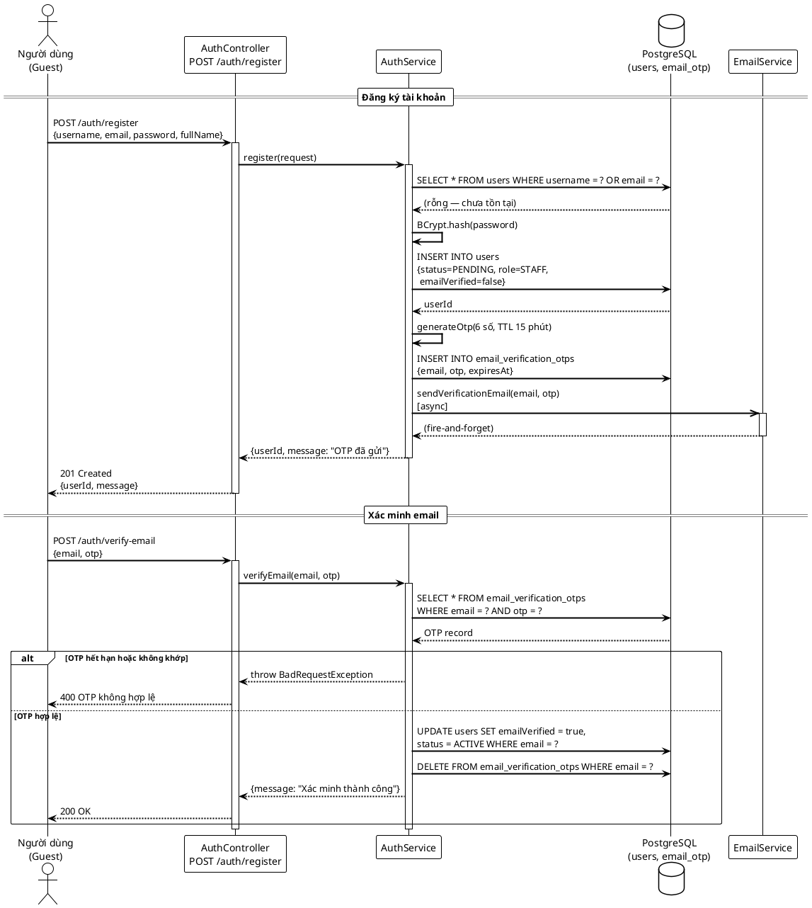

---

## 2. Đăng nhập & Làm mới Token

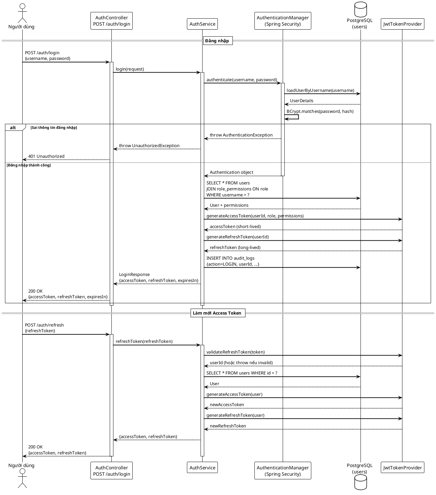

---

## 3. Quên mật khẩu & Đặt lại mật khẩu

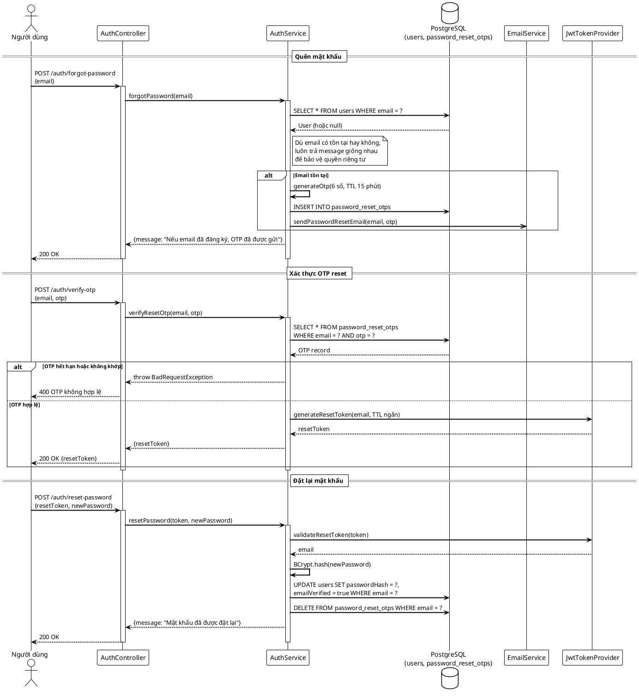

---

## 4. Admin duyệt tài khoản

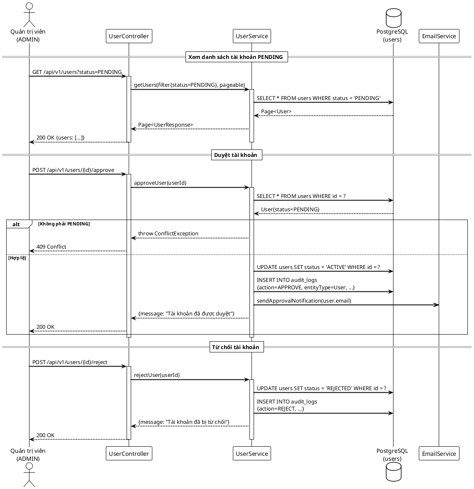

---

## 5. Tạo Chiến dịch & Voucher

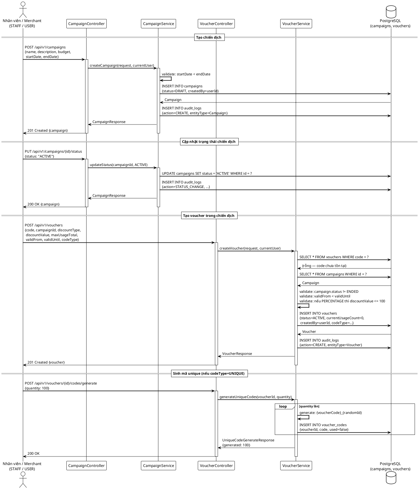

---

## 6. Phân phối Voucher qua Email

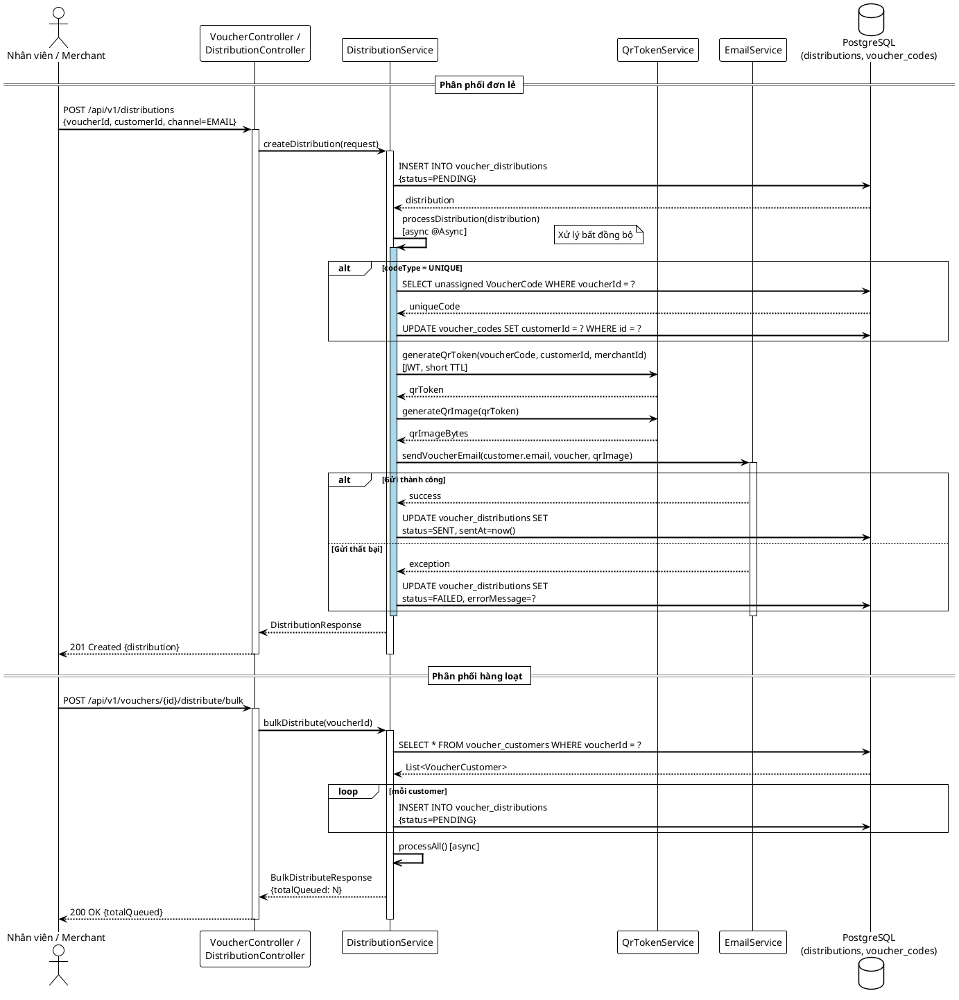

---

## 7. POS — Validate Voucher

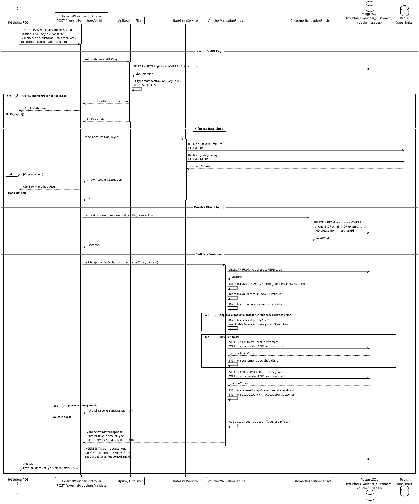

---

## 8. POS — Redeem Voucher (Đổi Voucher)

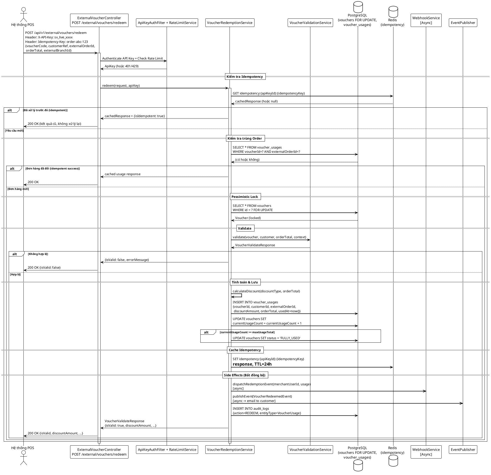

---

## 9. POS — Hoàn tác Đổi Voucher

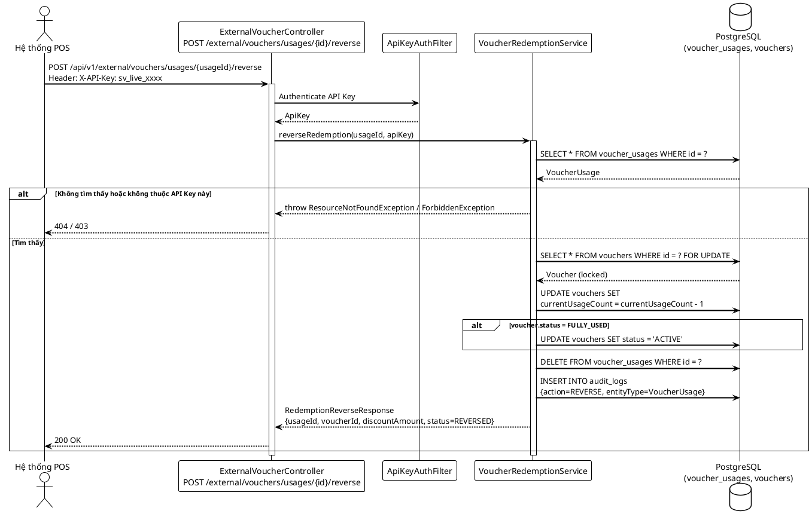

---

## 10. Tạo & Sử dụng API Key

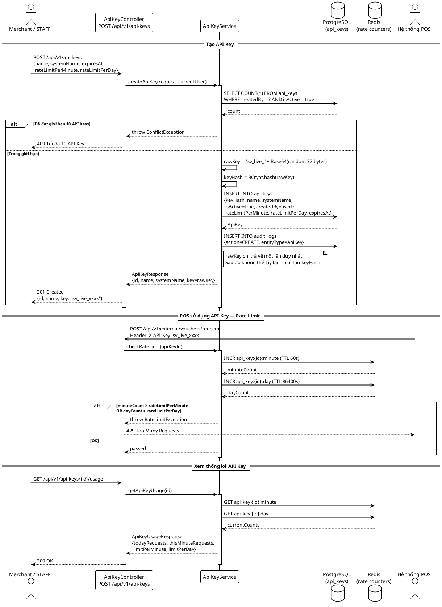

---

## 11. Webhook — Đăng ký & Tự động Dispatch

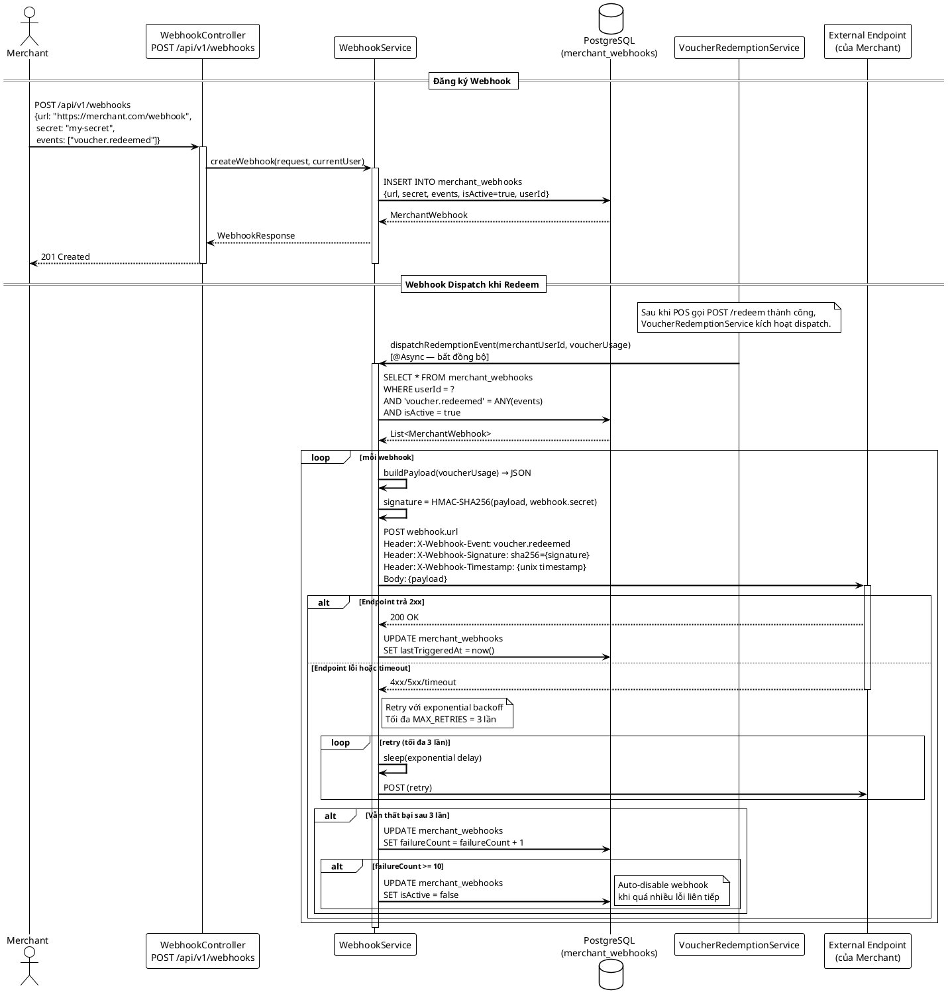

---

## 12. Phân quyền RBAC — Gán quyền cho Vai trò

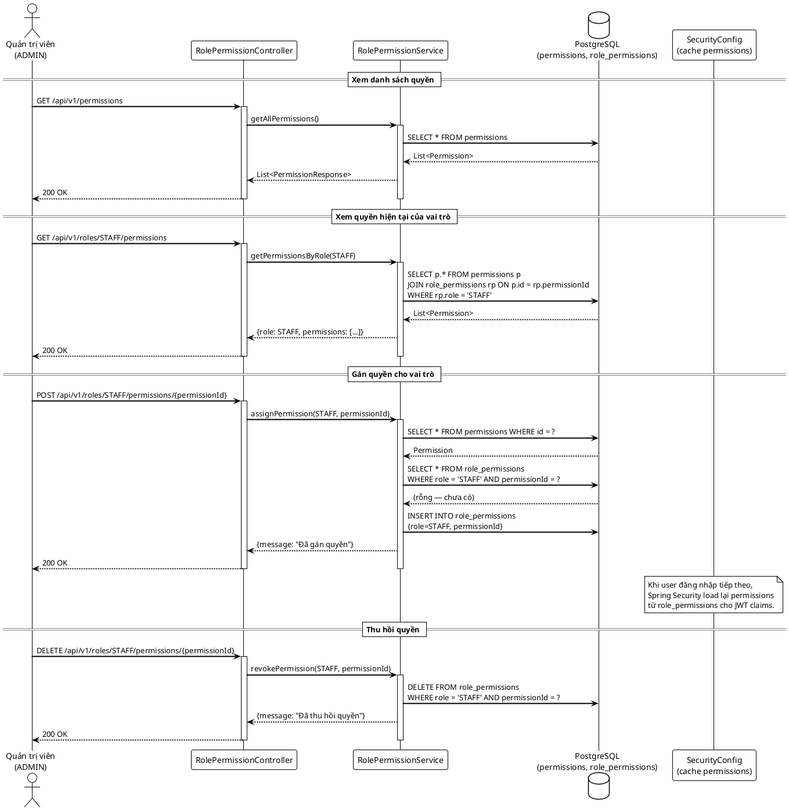
