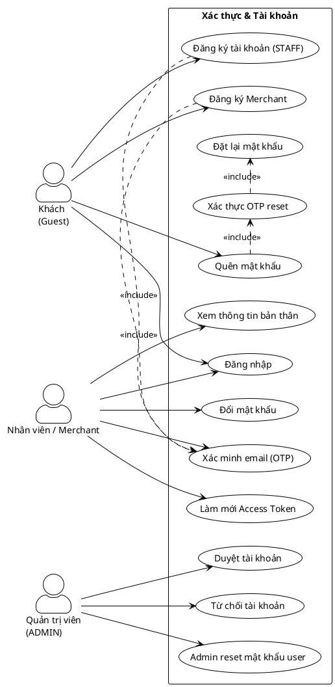
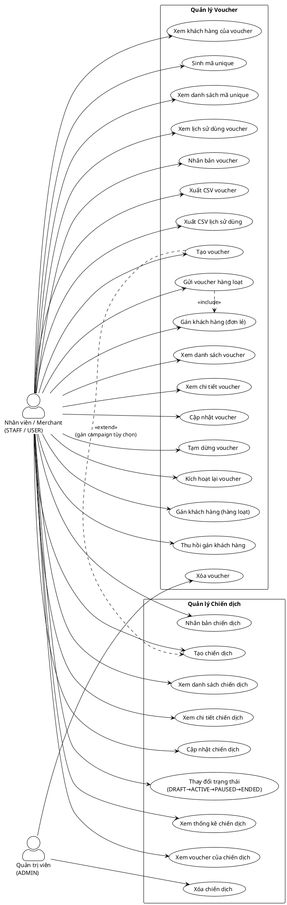
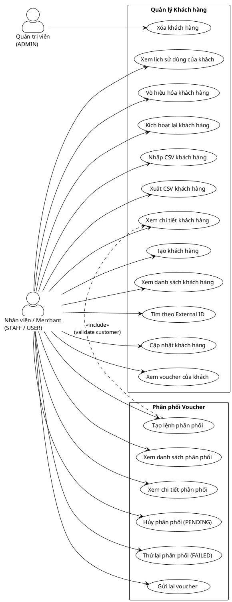
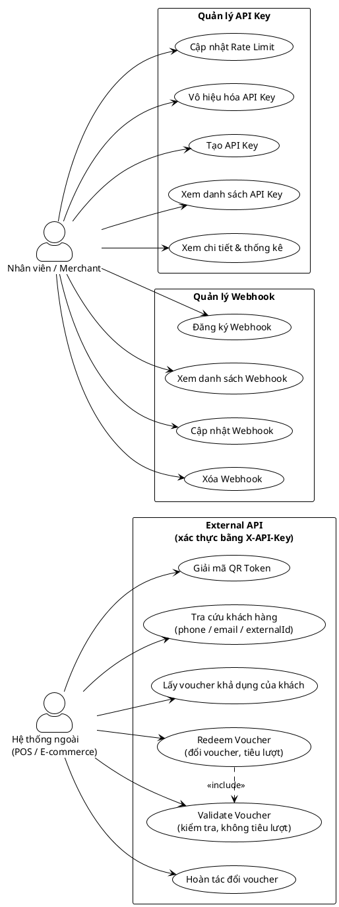
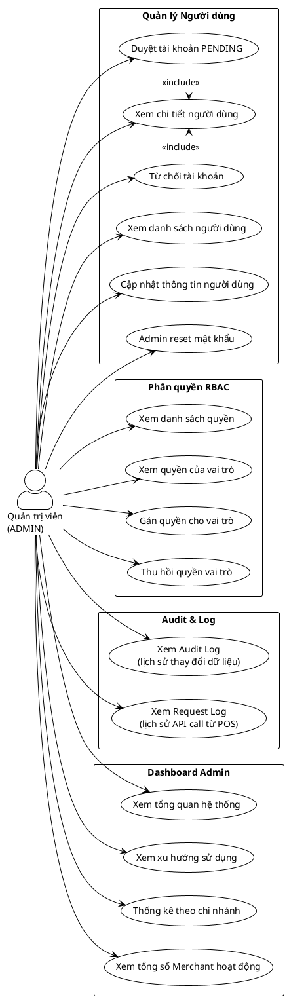

# Use Case Diagram — Smart Voucher System

> **Ngôn ngữ**: PlantUML  
> **Cập nhật**: 2026-03-31

---

## 1. Tổng quan Actor

| Actor | Mô tả | Xác thực |
|-------|-------|----------|
| **Quản trị viên (ADMIN)** | Toàn quyền hệ thống, quản lý user, phân quyền | JWT |
| **Nhân viên (STAFF)** | Tạo/quản lý voucher, campaign, customer, API Key | JWT |
| **Merchant (USER)** | Giống STAFF, có thể tự đăng ký, không có quyền xóa | JWT |
| **Hệ thống ngoài (POS/E-commerce)** | Validate, redeem voucher, tra cứu khách hàng | API Key (`X-API-Key`) |
| **Khách (Guest)** | Đăng ký tài khoản, quên mật khẩu | Không |

---

## 2. Sơ đồ tổng quan — Các Actor và Subsystem

```plantuml
@startuml UC-00-Overview
!theme plain
skinparam actorStyle awesome
skinparam packageStyle rectangle
skinparam ArrowColor #333333
skinparam ActorBorderColor #555555
skinparam UsecaseBorderColor #336699
skinparam UsecaseBackgroundColor #EEF4FF
left to right direction

actor "Khách\n(Guest)" as GUEST #lightgray
actor "Nhân viên\n(STAFF)" as STAFF #lightblue
actor "Merchant\n(USER)" as MERCHANT #lightyellow
actor "Quản trị viên\n(ADMIN)" as ADMIN #lightcoral
actor "Hệ thống ngoài\n(POS / E-commerce)" as EXTERNAL #lightgreen

rectangle "Smart Voucher System" {

  package "Xác thực & Tài khoản" as PKG_AUTH {
    usecase "Đăng ký / Đăng nhập" as UC_AUTH
    usecase "Quên / Đổi mật khẩu" as UC_PWD
  }

  package "Quản lý Chiến dịch" as PKG_CAMPAIGN {
    usecase "CRUD Campaign" as UC_CAMPAIGN
    usecase "Theo dõi thống kê" as UC_CAMPAIGN_STATS
  }

  package "Quản lý Voucher" as PKG_VOUCHER {
    usecase "CRUD Voucher" as UC_VOUCHER
    usecase "Gán khách hàng" as UC_VOUCHER_ASSIGN
    usecase "Sinh mã unique / QR" as UC_VOUCHER_CODES
  }

  package "Phân phối Voucher" as PKG_DIST {
    usecase "Gửi voucher (Email/SMS)" as UC_DIST
    usecase "Theo dõi trạng thái gửi" as UC_DIST_STATUS
  }

  package "Quản lý Khách hàng" as PKG_CUSTOMER {
    usecase "CRUD Khách hàng" as UC_CUSTOMER
    usecase "Import/Export CSV" as UC_CUSTOMER_CSV
  }

  package "API Key & Tích hợp" as PKG_APIKEY {
    usecase "Quản lý API Key" as UC_APIKEY
    usecase "Quản lý Webhook" as UC_WEBHOOK
  }

  package "External API\n(dành cho POS)" as PKG_EXTERNAL {
    usecase "Validate Voucher" as UC_VALIDATE
    usecase "Redeem Voucher" as UC_REDEEM
    usecase "Tra cứu Voucher / KH" as UC_LOOKUP
  }

  package "Quản trị Hệ thống" as PKG_ADMIN {
    usecase "Quản lý Người dùng" as UC_USER_MGMT
    usecase "Phân quyền RBAC" as UC_RBAC
    usecase "Xem Audit / Request Log" as UC_LOGS
  }

  package "Dashboard & Báo cáo" as PKG_DASHBOARD {
    usecase "Xem tổng quan & xu hướng" as UC_DASHBOARD
  }
}

GUEST      --> UC_AUTH
GUEST      --> UC_PWD

STAFF      --> UC_AUTH
STAFF      --> UC_PWD
STAFF      --> UC_CAMPAIGN
STAFF      --> UC_CAMPAIGN_STATS
STAFF      --> UC_VOUCHER
STAFF      --> UC_VOUCHER_ASSIGN
STAFF      --> UC_VOUCHER_CODES
STAFF      --> UC_DIST
STAFF      --> UC_DIST_STATUS
STAFF      --> UC_CUSTOMER
STAFF      --> UC_CUSTOMER_CSV
STAFF      --> UC_APIKEY
STAFF      --> UC_WEBHOOK
STAFF      --> UC_DASHBOARD

MERCHANT   --> UC_AUTH
MERCHANT   --> UC_PWD
MERCHANT   --> UC_CAMPAIGN
MERCHANT   --> UC_CAMPAIGN_STATS
MERCHANT   --> UC_VOUCHER
MERCHANT   --> UC_VOUCHER_ASSIGN
MERCHANT   --> UC_VOUCHER_CODES
MERCHANT   --> UC_DIST
MERCHANT   --> UC_DIST_STATUS
MERCHANT   --> UC_CUSTOMER
MERCHANT   --> UC_CUSTOMER_CSV
MERCHANT   --> UC_APIKEY
MERCHANT   --> UC_WEBHOOK
MERCHANT   --> UC_DASHBOARD

ADMIN      --> UC_AUTH
ADMIN      --> UC_PWD
ADMIN      --> UC_CAMPAIGN
ADMIN      --> UC_CAMPAIGN_STATS
ADMIN      --> UC_VOUCHER
ADMIN      --> UC_VOUCHER_ASSIGN
ADMIN      --> UC_VOUCHER_CODES
ADMIN      --> UC_DIST
ADMIN      --> UC_DIST_STATUS
ADMIN      --> UC_CUSTOMER
ADMIN      --> UC_CUSTOMER_CSV
ADMIN      --> UC_APIKEY
ADMIN      --> UC_WEBHOOK
ADMIN      --> UC_DASHBOARD
ADMIN      --> UC_USER_MGMT
ADMIN      --> UC_RBAC
ADMIN      --> UC_LOGS

EXTERNAL   --> UC_VALIDATE
EXTERNAL   --> UC_REDEEM
EXTERNAL   --> UC_LOOKUP

@enduml
```

---

## 3. Xác thực & Quản lý tài khoản

---

## 4. Quản lý Chiến dịch & Voucher

---

## 5. Khách hàng & Phân phối

---

## 6. External API — POS / E-commerce

---

## 7. Quản trị Hệ thống (Admin)

